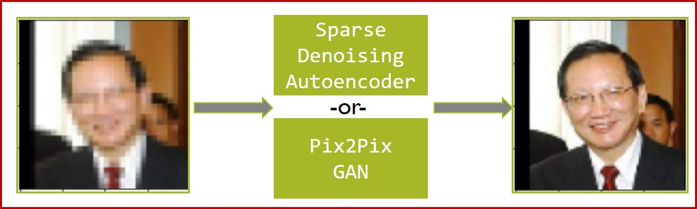

# Facial Image Upscaling using Sparse Denoising Autoencoders (SDAEs) and Generative Adversarial Networks (GANs)

## Introduction
Even in this era of digital images, we still come across pictures and media that are hazy, pixelated, and blurry. The reasons behind this are many, be it low-quality imaging sensors, poor image stabilization, or the fact that the image was taken a long time ago.

This project aims to utilize the following two DL architectures to “upscale these images” and compare their results:
  1. Sparse Denoising Autoencoders
  2. Pix2Pix GAN

## Methodology

### Dataset Used
[Labelled Faces in the Wild (LFW)](https://vis-www.cs.umass.edu/lfw/)

### Data Preprocessing
  * A subset of the dataset was used.
  * The images were artificially pixelated using interpolation.

### Technical Specs
  * Python 3: NumPy, Pandas, Matplotlib, PlotLy, Scikit-Learn
  * DL Framework(s):  Tensorflow, Keras, FastAI
  * Trained on: Google Colab (GPU runtime)
    - Pix2Pix: GAN exceeded usage limit on colab -> Trained on Kaggle Kernel (NVIDIA P100)

## Results

### SDAE
  1. **Predictions for images present in the dataset**
  
  2. **Predictions for new images (not in the dataset)**
  

### Pix2Pix GAN
  1. **Predictions for images present in the dataset**
  
  2. **Predictions for new images (not in the dataset)**
  

## Limitations

  * Images where there is no clear face + faded background, i.e. “too much going on.”
  * Models generate superficial features (extra wrinkles on cheeks)
  * Pix2Pix GAN will probably need a lot more computation power to be able to generalize (more epochs + bigger dataset)
